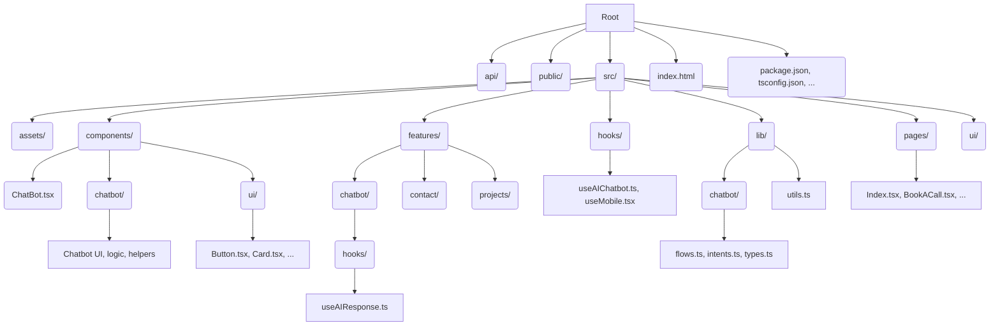

# Project Structure

This document describes the folder and file organization for the Moruf Prompt Engineer Portfolio project, along with best practices and conventions.

---

## Root

- `api/` — Serverless API routes (chatbot, booking, lead capture)
- `public/` — Static assets (images, icons, manifest)
- `src/` — Main source code
- `index.html` — Main HTML entry point
- `package.json`, `tsconfig.json`, etc. — Project configuration

## src/

- `assets/` — Static images and assets used in the app
- `components/` — Reusable UI and page-level components
  - `chatbot/` — Chatbot-specific UI, logic, and helpers
  - `ui/` — Generic UI components (buttons, cards, etc.)
- `features/` — Domain-driven feature modules
  - `chatbot/` — Chatbot logic (hooks, state, etc.)
  - `contact/`, `projects/` — Other features (expand as needed)
- `hooks/` — Custom React hooks
- `lib/` — Shared utilities, types, and chatbot flows/intents
- `pages/` — Top-level pages (one per route/case study)
- `ui/` — Generic UI components (if not in `components/ui/`)

## Best Practices

- **No empty folders:** Remove folders with no files.
- **Consistent naming:**
  - Components: `PascalCase.tsx`
  - Hooks: `useCamelCase.ts(x)`
  - Utilities: `camelCase.ts`
- **Feature-first:** Place domain logic in `features/` when possible.
- **UI separation:** Generic UI in `components/ui/` or `src/ui/`, feature-specific UI in feature folders.
- **API routes:** All backend/serverless logic in `api/`.

## Example Structure

```
api/
public/
src/
  assets/
  components/
    ChatBot.tsx
    chatbot/
      ...
    ui/
      Button.tsx
      Card.tsx
  features/
    chatbot/
      hooks/
        useAIResponse.ts
      ...
    contact/
    projects/
  hooks/
    useAIChatbot.ts
    useMobile.tsx
  lib/
    chatbot/
      flows.ts
      intents.ts
      types.ts
    utils.ts
  pages/
    Index.tsx
    BookACall.tsx
    ...
  ui/
    ...
```

---

## Visual Diagram

Below is a visual diagram of the project structure for quick understanding:



---

**Keep this structure up to date as the project evolves.**
